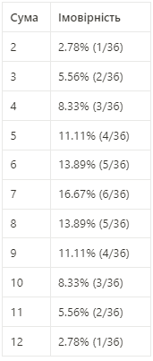

# Фінальний проект
## Завдання 7 - висновок.
Аналітичні результати

Результати отримані методом Монте-Крало для 10 000 експериментів

| Sum | Probability |
|-----|-------------|
| 2   | 2.73        |
| 3   | 5.56        |
| 4   | 8.80        |
| 5   | 11.1        |
| 6   | 13.86       |
| 7   | 17.05       |
| 8   | 13.83       |
| 9   | 10.83       |
| 10  | 8.33        |
| 11  | 5.21        |
| 12  | 2.7         |

Порівнявши таблиці можна зробити висновок, що метод Монте-Крало дав доволі точний результат, підтвердивши свою ефекктивність.
Для ще більшої точності достатньо збільшити к-ть експериментів.